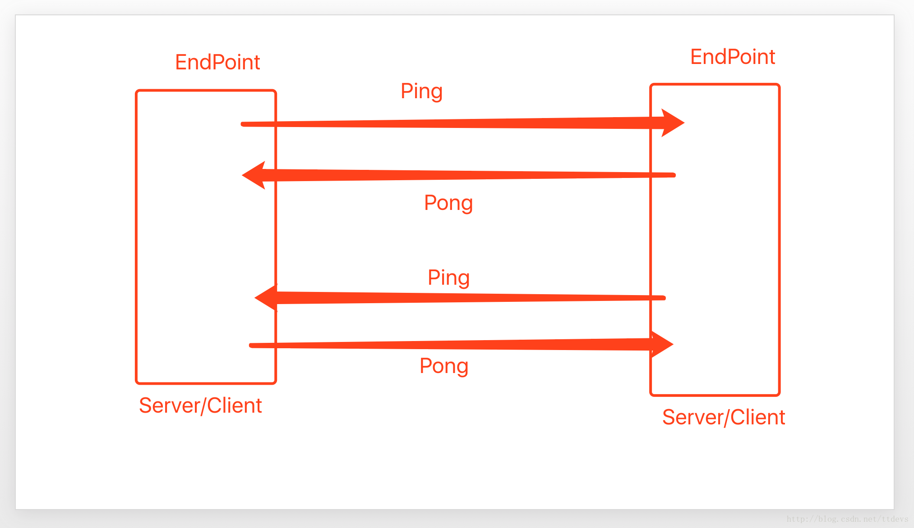

# WebSocket的支持
okhttp集成了websocket，使用websocket只需要这样写:
```java
  OkHttpClient.Builder builder = new OkHttpClient.Builder();
        OkHttpClient client = builder.build();
        Request.Builder requestBuilder = new Request.Builder();
        requestBuilder.url("ws://192.168.1.101:8888/ws");
        final WebSocket webSocket = client.newWebSocket(requestBuilder.build(),
                                                        new WebSocketListener() {
            @Override
            public void onOpen(WebSocket webSocket, Response response) {
                super.onOpen(webSocket, response);
                webSocket.send("hello websocket");
            }

            @Override
            public void onMessage(WebSocket webSocket, String text) {
                super.onMessage(webSocket, text);
            }

            @Override
            public void onMessage(WebSocket webSocket, ByteString bytes) {
                super.onMessage(webSocket, bytes);
            }

            @Override
            public void onClosing(WebSocket webSocket, int code, String reason) {
                super.onClosing(webSocket, code, reason);
            }

            @Override
            public void onClosed(WebSocket webSocket, int code, String reason) {
                super.onClosed(webSocket, code, reason);
            }

            @Override
            public void onFailure(WebSocket webSocket, Throwable t, Response response) {
                super.onFailure(webSocket, t, response);
            }
        });


```
发送消息给服务器
```java
webSocket.send("hello websocket");

```

来看底层实现:
HttpClient.newWebSocket()调用后会new 一个RealWebSocket
```java
 RealWebSocket webSocket = new RealWebSocket(request, listener, new Random());
    webSocket.connect(this);

```

## RealWebSocket.java

### 的构造函数:
```java
public RealWebSocket(Request request, WebSocketListener listener, Random random) {
    if (!"GET".equals(request.method())) {//必需要是get请求
      throw new IllegalArgumentException("Request must be GET: " + request.method());
    }
    this.originalRequest = request;
    this.listener = listener;
    this.random = random;

    byte[] nonce = new byte[16];
    random.nextBytes(nonce);
    this.key = ByteString.of(nonce).base64();//生成一个随机的key后面会成为Sec-WebSocket-Key的Header值

    this.writerRunnable = new Runnable() {//起了一个Runnable，无限循环
      @Override public void run() {
        try {
          while (writeOneFrame()) {
          }
        } catch (IOException e) {
          failWebSocket(e, null);
        }
      }
    };
  }

```
### connect:
1.先是通过源request创建一个新的request，它会加上一些Header信息：Upgrade,Connection,Sec-WebSocket-Key等

2.创建RealCall发第一次请求

3.当第一次请求返回的时候需要走checkResponse

4.如果checkResponse通过，会告诉listener onOpen

5.初始化Reader和Writer initReaderAndWriter

6.把socket的读取时间设成0，表示没有超时时间，也就是长连接

7.启动loopReader
```java
  public void connect(OkHttpClient client) {
      client = client.newBuilder()
          .protocols(ONLY_HTTP1)
          .build();
      final int pingIntervalMillis = client.pingIntervalMillis();
      final Request request = originalRequest.newBuilder()
          .header("Upgrade", "websocket")
          .header("Connection", "Upgrade")
          .header("Sec-WebSocket-Key", key)
          .header("Sec-WebSocket-Version", "13")
          .build();
      call = Internal.instance.newWebSocketCall(client, request);
      call.enqueue(new Callback() {
        @Override public void onResponse(Call call, Response response) {
          try {
            checkResponse(response);
          } catch (ProtocolException e) {
            failWebSocket(e, response);
            closeQuietly(response);
            return;
          }

          // Promote the HTTP streams into web socket streams.
          StreamAllocation streamAllocation = Internal.instance.streamAllocation(call);
          streamAllocation.noNewStreams(); // Prevent connection pooling!
          Streams streams = streamAllocation.connection().newWebSocketStreams(streamAllocation);

          // Process all web socket messages.
          try {
            listener.onOpen(RealWebSocket.this, response);
            String name = "OkHttp WebSocket " + request.url().redact();
            initReaderAndWriter(name, pingIntervalMillis, streams);
            streamAllocation.connection().socket().setSoTimeout(0);
            loopReader();
          } catch (Exception e) {
            failWebSocket(e, null);
          }
        }

        @Override public void onFailure(Call call, IOException e) {
          failWebSocket(e, null);
        }
      });
    }

```

#### checkResponse:
1.状态码是101表示握手成功，否则就是握手异常

2.Connection的值必需是Upgrade

3.Upgrade的值必需是websocket

4.Sec-WebSocket-Accept的值必需是
ByteString.encodeUtf8(key + WebSocketProtocol.ACCEPT_MAGIC).sha1().base64()
> 也就是说服务器收到客户端的key,再在基础上加上ACCEPT_MAGIC然后sha1+base64得到的字符

```java

void checkResponse(Response response) throws ProtocolException {
    if (response.code() != 101) {
      throw new ProtocolException("Expected HTTP 101 response but was '"
          + response.code() + " " + response.message() + "'");
    }

    String headerConnection = response.header("Connection");
    if (!"Upgrade".equalsIgnoreCase(headerConnection)) {
      throw new ProtocolException("Expected 'Connection' header value 'Upgrade' but was '"
          + headerConnection + "'");
    }

    String headerUpgrade = response.header("Upgrade");
    if (!"websocket".equalsIgnoreCase(headerUpgrade)) {
      throw new ProtocolException(
          "Expected 'Upgrade' header value 'websocket' but was '" + headerUpgrade + "'");
    }

    String headerAccept = response.header("Sec-WebSocket-Accept");
    String acceptExpected = ByteString.encodeUtf8(key + WebSocketProtocol.ACCEPT_MAGIC)
        .sha1().base64();
    if (!acceptExpected.equals(headerAccept)) {
      throw new ProtocolException("Expected 'Sec-WebSocket-Accept' header value '"
          + acceptExpected + "' but was '" + headerAccept + "'");
    }
  }
```

#### initReaderAndWriter:

```java
  public void initReaderAndWriter(
      String name, long pingIntervalMillis, Streams streams) throws IOException {
    synchronized (this) {
      this.streams = streams;
      this.writer = new WebSocketWriter(streams.client, streams.sink, random);
      this.executor = new ScheduledThreadPoolExecutor(1, Util.threadFactory(name, false));
      if (pingIntervalMillis != 0) {
        executor.scheduleAtFixedRate(
            new PingRunnable(), pingIntervalMillis, pingIntervalMillis, MILLISECONDS);
      }
      if (!messageAndCloseQueue.isEmpty()) {
        runWriter(); // Send messages that were enqueued before we were connected.
      }
    }

    reader = new WebSocketReader(streams.client, streams.source, this);
  }

```

1.通过scheduleAtFixedRate每过一定的时间发ping

2.如果消息队列（messageAndCloseQueue）不为空就执行一次write

3.初始化WebSocketReader

##### 心跳包之-发ping和接收pong的流程
client发起ping,会收到server的pong，同样server发ping,client会回一个pong



pingRunnable会在executor中每隔一定的时间就执行一次(pingInterval可以配置)
```java
private final class PingRunnable implements Runnable {
    PingRunnable() {
    }

    @Override public void run() {
      writePingFrame();
    }
  }

  void writePingFrame() {
    WebSocketWriter writer;
    synchronized (this) {
      if (failed) return;
      writer = this.writer;
    }

    try {
      writer.writePing(ByteString.EMPTY);
    } catch (IOException e) {
      failWebSocket(e, null);
    }
  }

```
而pong则是服务器的返回:收到pong的返回，只是pongCount++
```java
  @Override public synchronized void onReadPong(ByteString buffer) {
    // This API doesn't expose pings.
    pongCount++;
  }

```

如果服务器主动发ping会走到onReadPing，此时会把要发的pong加入到Queue，然后启动writer
```java
//作者用了一个Deque来装载所有服务器返回来的pong
private final ArrayDeque<ByteString> pongQueue = new ArrayDeque<>();

public synchronized void onReadPing(ByteString payload) {
    // Don't respond to pings after we've failed or sent the close frame.
    if (failed || (enqueuedClose && messageAndCloseQueue.isEmpty())) return;

    pongQueue.add(payload);
    runWriter();
    pingCount++;
}

```

runWriter只是执行了一个writerRunnable
```java
private void runWriter() {
    assert (Thread.holdsLock(this));

    if (executor != null) {
      executor.execute(writerRunnable);
    }
  }

```

这个writerRunnable会循环执行writeOneFrame,如果返回true的话

```java
 this.writerRunnable = new Runnable() {
      @Override public void run() {
        try {
          while (writeOneFrame()) {
          }
        } catch (IOException e) {
          failWebSocket(e, null);
        }
      }
    };

```

###### writeOneFrame代码

```java
boolean writeOneFrame() throws IOException {

   //...ignore code
      writer = this.writer;
      pong = pongQueue.poll();
      if (pong == null) {
        messageOrClose = messageAndCloseQueue.poll();
        if (messageOrClose instanceof Close) {
            //...ignore code 处理Close的消息
            this.executor.shutdown();
          } else {
           //...ignore code
        }
      }
    }

    try {
      if (pong != null) {
      //不为空就写pong
        writer.writePong(pong);

      } else if (messageOrClose instanceof Message) {
       //...ignore code
       //处理 message
        sink.write(data);
        sink.close();
        synchronized (this) {
          queueSize -= data.size();
        }

      } else if (messageOrClose instanceof Close) {
       //...ignore code处理close

     //...ignore code
  }


```

#### WebSocketReader的loopReader

```java
 public void loopReader() throws IOException {
    while (receivedCloseCode == -1) {
      reader.processNextFrame();
    }
  }

```

只要receivedCloseCode==-1就一直执行processNextFrame

1.解析reader

2.读控制类的数据（如ping,pong,close等与业务无关的数据）

3.读消息（与业务相关）

```java
  void processNextFrame() throws IOException {
    readHeader();
    if (isControlFrame) {
      readControlFrame();
    } else {
      readMessageFrame();
    }
  }

```
##### readHeader

```java
private void readHeader() throws IOException {
    if (closed) throw new IOException("closed");

    // Disable the timeout to read the first byte of a new frame.
    int b0;
    long timeoutBefore = source.timeout().timeoutNanos();
    source.timeout().clearTimeout();
    try {
      b0 = source.readByte() & 0xff;
    } finally {
      source.timeout().timeout(timeoutBefore, TimeUnit.NANOSECONDS);
    }
     opcode = b0 & B0_MASK_OPCODE;//0b00001111
     isFinalFrame = (b0 & B0_FLAG_FIN) != 0;//0b10000000
     isControlFrame = (b0 & OPCODE_FLAG_CONTROL) != 0;//0b00001000

```
读第一个byte也就是第一个8位的数，后四位是opcode:

数据包类型（frame type），占4bits

0x0：标识一个中间数据包<br>
0x1：标识一个text类型数据包<br>
0x2：标识一个binary类型数据包<br>
0x3-7：保留<br>
0x8：标识一个断开连接类型数据包<br>
0x9：标识一个ping类型数据包<br>
0xA：表示一个pong类型数据包<br>
0xB-F：保留<br>
isFinalFrame是不是最后一Frame，用第一位来表示<br>
isControlFrame是不是操作Frame<br>

##### 来看看readControlFrame代码
1.处理ping<br>
2.处理pong<br>
3.处理关闭<br>

  ```java
   switch (opcode) {

    static final int OPCODE_CONTROL_CLOSE = 0x8;
     static final int OPCODE_CONTROL_PING = 0x9;
     static final int OPCODE_CONTROL_PONG = 0xa;
   }
        case OPCODE_CONTROL_PING:
          frameCallback.onReadPing(buffer.readByteString());
          break;
        case OPCODE_CONTROL_PONG:
          frameCallback.onReadPong(buffer.readByteString());
          break;
        case OPCODE_CONTROL_CLOSE:
          int code = CLOSE_NO_STATUS_CODE;
          //...ignore code
           frameCallback.onReadClose(code, reason);

  ```

##### readMessageFrame则是读取数据
```java
  private void readMessageFrame() throws IOException {
    int opcode = this.opcode;
    if (opcode != OPCODE_TEXT && opcode != OPCODE_BINARY) {
      throw new ProtocolException("Unknown opcode: " + toHexString(opcode));
    }

    Buffer message = new Buffer();
    readMessage(message);

    if (opcode == OPCODE_TEXT) {
      frameCallback.onReadMessage(message.readUtf8());
    } else {
      frameCallback.onReadMessage(message.readByteString());
    }
  }

```


