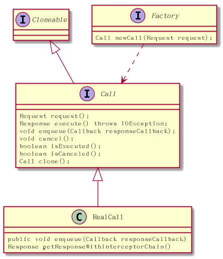

# OKHttp初探－－Call

```java

public interface Call extends Cloneable {
Request request();//返回request对象
Response execute() throws IOException;//执行网络请求，返回Response
void enqueue(Callback responseCallback);//
void cancel();
boolean isExecuted();
boolean isCanceled();
Call clone();

}

```



这里面Call有点像Future，有cancel能力。这点是一个重大优势，以往android的请求引擎里不会有cancel功能，cancel都得靠volley,Glide等第三方框架去实现.这是一大进步

## RealCall 成员

RealCall是Call的实现类,它的成员有:
EventListener 后期要加的模块
OkHttpClient client 通过它可以拿到dispatcher等
RetryAndFollowUpInterceptor retryAndFollowUpInterceptor用来处理cancel的
final Request originalRequest 原请求
final boolean forWebSocket 标记是否用webSocket
private boolean executed;　标记是否执行过(只要调用execute方法)

## RealCall行为
request() 返回request
execute() 执行请求
captureCallStackTrace() 截取调用stack　值得学习！
enqueue() 异步执行请求　
cancel() 取消
isExecuted() 是否被执行过
streamAllocation() 暂时不知道干啥的
AsyncCall 内部类,用来处理异步请求用到的
redactedUrl() url的摘要，便于打log

##重点：execute()

第一章我们讲到： Response response = call.execute();

来分析代码
```java
public Response execute() throws IOException {
    synchronized (this) {
      if (executed) throw new IllegalStateException("Already Executed");
      executed = true;
    }
    captureCallStackTrace();
    try {
      client.dispatcher().executed(this);
      Response result = getResponseWithInterceptorChain();
      if (result == null) throw new IOException("Canceled");
      return result;
    } finally {
      client.dispatcher().finished(this);
    }
  }

```

#### 1.一个call被多次调execute会抛异常
#### 2.captureCallStackTrace,创建一个Throwable，其实就是记录调用栈
#### 3.client.dispatcher().executed(this);让dispatcher去记录自己的状态
Dispatcher.java
```java
 synchronized void executed(RealCall call) {
    runningSyncCalls.add(call);
  }

```

#### 4.client.dispatcher().finished(this);让dispatcher移除自己
Dispatcher.java
```java

  private <T> void finished(Deque<T> calls, T call, boolean promoteCalls) {
    int runningCallsCount;
    Runnable idleCallback;
    synchronized (this) {
      if (!calls.remove(call)) throw new AssertionError("Call wasn't in-flight!");
      if (promoteCalls) promoteCalls();
      runningCallsCount = runningCallsCount();
      idleCallback = this.idleCallback;
    }

    if (runningCallsCount == 0 && idleCallback != null) {
      idleCallback.run();
    }
  }

```
#### getResponseWithInterceptorChain真正的请求实现。

## getResponseWithInterceptorChain

通过责任链的设计模式去发请求，后面的章节会详细讲解。
```java
Response getResponseWithInterceptorChain() throws IOException {
    // Build a full stack of interceptors.
    List<Interceptor> interceptors = new ArrayList<>();
    interceptors.addAll(client.interceptors());
    interceptors.add(retryAndFollowUpInterceptor);
    interceptors.add(new BridgeInterceptor(client.cookieJar()));
    interceptors.add(new CacheInterceptor(client.internalCache()));
    interceptors.add(new ConnectInterceptor(client));
    if (!forWebSocket) {
      interceptors.addAll(client.networkInterceptors());
    }
    interceptors.add(new CallServerInterceptor(forWebSocket));

    Interceptor.Chain chain = new RealInterceptorChain(
        interceptors, null, null, null, 0, originalRequest);
    return chain.proceed(originalRequest);
  }

```


