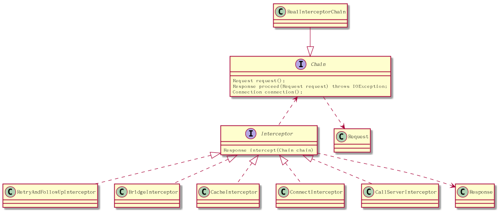
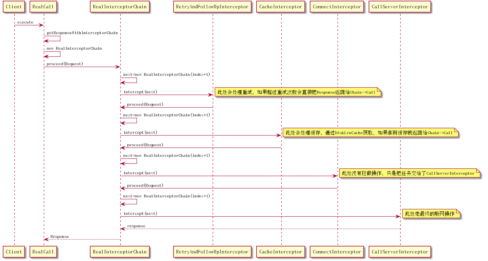

#OKhttp深入理解--责任链模式处理请求

本章重点讲解OKHttp通过责任链的方式处理请求。不了解责任链的同学可以学习一下责任链设计模式。

首先看一下类图　





RealCall调用execute会调到getResponseWithInterceptorChain方法
getResponseWithInterceptorChain方法里初始化责链
```java
Response getResponseWithInterceptorChain() throws IOException {
    // Build a full stack of interceptors.
    List<Interceptor> interceptors = new ArrayList<>();
    interceptors.addAll(client.interceptors());
    interceptors.add(retryAndFollowUpInterceptor);
    interceptors.add(new BridgeInterceptor(client.cookieJar()));
    interceptors.add(new CacheInterceptor(client.internalCache()));
    interceptors.add(new ConnectInterceptor(client));
    if (!forWebSocket) {
      interceptors.addAll(client.networkInterceptors());
    }
    interceptors.add(new CallServerInterceptor(forWebSocket));

    Interceptor.Chain chain = new RealInterceptorChain(
        interceptors, null, null, null, 0, originalRequest);
    return chain.proceed(originalRequest);
  }

```
RealInterceptorChain的proceed方法，创建了新的任务链next(index+1)，让第index个interceptor执行next任务。
假设index=0;
那么会让第0个interceptor执行new nextChain(Chain1),如果interceptor0没有拦截的话，它会调用Chain1的proceed。
Chain1里的index=1;
那么会让第1个interceptor执行new nextChain(Chain2),如果interceptor1没有拦截的话，它会调用Chain2的proceed。

...

责任连就这样一个一个传下去，如果某一个interceptor拦截了，或是到最后一个节点了，责任链停止。

```java
public Response proceed(Request request,
       StreamAllocation streamAllocation, HttpCodec httpCodec,
       RealConnection connection) throws IOException {
   //...ignore code

    RealInterceptorChain next = new RealInterceptorChain(
        interceptors, streamAllocation, httpCodec, connection, index + 1, request);
    Interceptor interceptor = interceptors.get(index);
    Response response = interceptor.intercept(next);
  //...ignore code

    return response;
  }

```

看看RetryAndFollowUpInterceptor的实现:

```java
public Response intercept(Chain chain) throws IOException {

   //...ignore code
    int followUpCount = 0;
    Response priorResponse = null;
    //...开启循环
    while (true) {
     //...ignore code

      Response response = null;
      boolean releaseConnection = true;
      try {
        //执行下一个责任链，如果下一个责任链返回成功，就会跳出循环，否则重试。
        response = ((RealInterceptorChain) chain).proceed(request, streamAllocation, null, null);
        releaseConnection = false;
      } catch (RouteException e) {
        // The attempt to connect via a route failed. The request will not have been sent.
        if (!recover(e.getLastConnectException(), false, request)) {
          throw e.getLastConnectException();
        }
        releaseConnection = false;
        continue;
      } catch (IOException e) {
        // An attempt to communicate with a server failed. The request may have been sent.
        boolean requestSendStarted = !(e instanceof ConnectionShutdownException);
        if (!recover(e, requestSendStarted, request)) throw e;
        releaseConnection = false;
        continue;
      } finally {
        // We're throwing an unchecked exception. Release any resources.
        if (releaseConnection) {
          streamAllocation.streamFailed(null);
          streamAllocation.release();
        }
      }

      // Attach the prior response if it exists. Such responses never have a body.
      if (priorResponse != null) {
        response = response.newBuilder()
            .priorResponse(priorResponse.newBuilder()
                    .body(null)
                    .build())
            .build();
      }

      //判断是否要重定向
      Request followUp = followUpRequest(response);

      if (followUp == null) {
        if (!forWebSocket) {
          streamAllocation.release();
        }
        return response;
      }

      closeQuietly(response.body());

        //重定向的次数不能超过20
      if (++followUpCount > MAX_FOLLOW_UPS) {
        streamAllocation.release();
        throw new ProtocolException("Too many follow-up requests: " + followUpCount);
      }

      if (followUp.body() instanceof UnrepeatableRequestBody) {
        streamAllocation.release();
        throw new HttpRetryException("Cannot retry streamed HTTP body", response.code());
      }

      if (!sameConnection(response, followUp.url())) {
        streamAllocation.release();
        streamAllocation = new StreamAllocation(
            client.connectionPool(), createAddress(followUp.url()), callStackTrace);
      } else if (streamAllocation.codec() != null) {
        throw new IllegalStateException("Closing the body of " + response
            + " didn't close its backing stream. Bad interceptor?");
      }

      request = followUp;
      priorResponse = response;
    }
  }

```

1.在执行下一个责任链的时候，如果有异常，它会调用recover来判断是否需要重新请求

2.如果followUp重定向成功，会重新创建Request去发请求

3.超时重试需要自己实现，OKHttp超时重试没做支持

